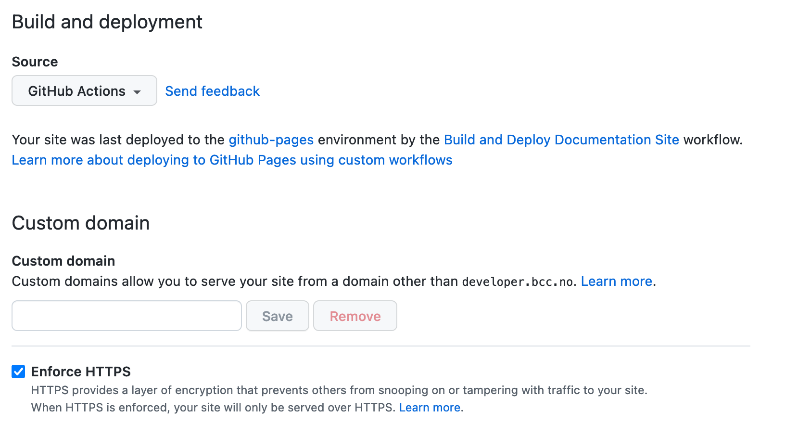

# Introduction

Here you will find guides and tips on how to set up and maintain documentation for BCC projects. We value good documentation for both our open source and internal projects. Because we recognize it is hard to keep documentation up-to-date, we try to make it as easy as possible to maintain and publish documentation to our website, [developer.bcc.no](https://developer.bcc.no).

## Get started

### Folder structure
We recommend to use the following conventions when writing documentation:
- Use a `docs` folder for all public documentation about your project.
- Use the readme in the main folder only for information that is needed to run that project locally. Generally this kind of information is not interesting for people reading documentation about an API for example. If this information does need to be in the public documentation, link to the readme in the `docs` folder from the main readme.

### Publishing documentation
Documentation can be published to [developer.bcc.no](https://developer.bcc.no) with VuePress. For this we have created a [custom theme](./vuepress/). To convert a `docs` folder into a VuePress site, follow these steps:

1. Enable GitHub Pages in the settings of the repository. Be sure to select **GitHub Actions** as the `Source`, and check `Enforce HTTPS`. Then your settings should look like this:



2. Create a new file in `.github/workflows` named `build-and-deploy-documentation.yml`, and copy the following contents to it:

::: details build-and-deploy-documentation.yml
```yml
name: Build and Deploy Documentation Site

on:
  # Runs on pushes targeting the default branch
  push:
    branches: ["master","main"]

  # Allows you to run this workflow manually from the Actions tab
  workflow_dispatch:

# Sets permissions of the GITHUB_TOKEN to allow deployment to GitHub Pages
permissions:
  contents: read
  pages: write
  id-token: write

# Allow one concurrent deployment
concurrency:
  group: "pages"
  cancel-in-progress: true

jobs:
  build:
    runs-on: ubuntu-latest
    steps:
      # Check out the template repository
      - name: Check out template repository
        uses: actions/checkout@v2
        with:
          repository: bcc-code/bcc-documentation-base

      # Pull the repository documentation and push it to the source folder
      - name: Check out current repository
        uses: actions/checkout@v2
        with:
          path: source

      # Copy the source documentation to the docs
      # ** The "$GITHUB_WORKSPACE/docs/" folder is the target for documenation (.md) files/folder. 
      - name: List folders
        run: |
          cd source
          cp -r ./docs/* $GITHUB_WORKSPACE/vuepress/docs/
      # Configure parameters for documentation page
      # ** TODO: Consider replacing title with a more friendly name
      # ** The base and repository must match the repository name. Otherwise the page won't be compatibile with the github pages.
      - uses: microsoft/variable-substitution@v1
        with:
          files: "vuepress/docs/.vuepress/data.json"
        env:
          title: ${{ github.event.repository.name }}
          description: ${{ github.event.repository.description }}
          base: /${{ github.event.repository.name }}/
          docsRepo: ${{ github.repository }}

      # Build the VuePress site
      - name: Build VuePress site
        run: |
          cd vuepress
          npm i && npm run build
     
      # Upload build output to artifact
      - name: Upload artifact
        uses: actions/upload-pages-artifact@v1
        with:
          path: vuepress/docs/.vuepress/dist
        
 # Deployment job
  deploy:
    environment:
      name: github-pages
      url: ${{ steps.deployment.outputs.page_url }}
    runs-on: ubuntu-latest
    needs: build
    steps:
      - name: Deploy to GitHub Pages
        id: deployment
        uses: actions/deploy-pages@v1
```
:::

Be sure to adjust the paths if your docs come from a different folder, and to update the name and description of the repository. Generally it is advised to **not** prefix the name with "BCC".

3. Push this to the main branch of the repository and you documentation site should be deployed to developer.bcc.no/repository-name/ 🎉
