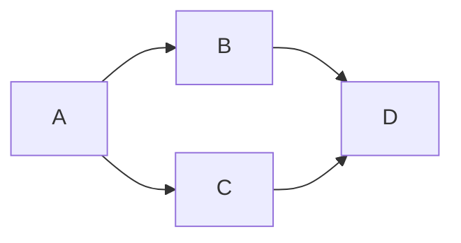
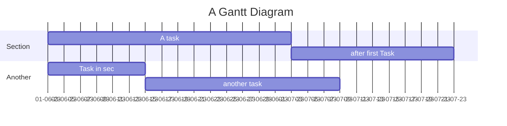
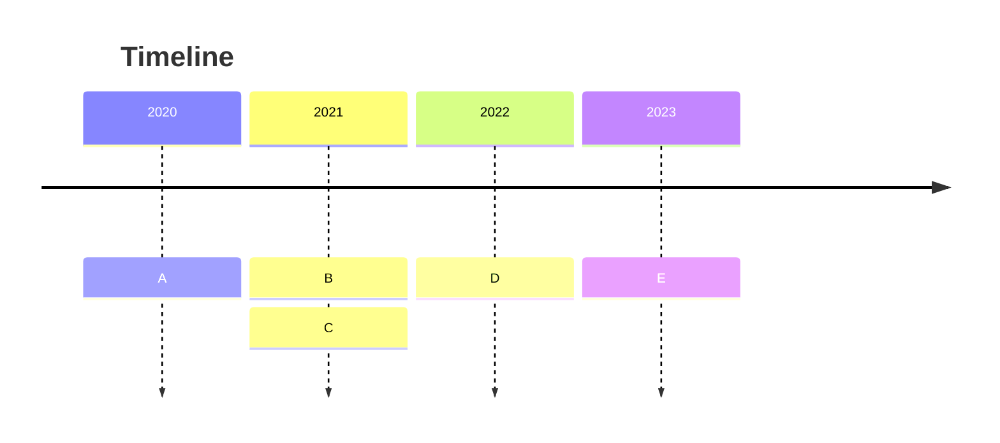

# VuePress

The documentation sites (like this one) use a custom [VuePress 2](https://v2.vuepress.vuejs.org/guide/) theme, based on the default theme. This means that any [Markdown plugins](https://v2.vuepress.vuejs.org/guide/markdown.html) used by VuePress and its default theme can also be used in your documentation.

## Index file
There should always be an index file in the root of the `docs` folder, either named `README.md` or `index.md`. Never add both files to the same folder, as VuePress will be confused as to which one to treat as the homepage of the site.

## Sidebar navigation
This theme will build a sidebar from the folder structure in your `docs` folder.

### Title
The page title in the sidebar is derived from the `title` property in the frontmatter or the primary heading in each Markdown file.
```md
---
title: My Page
---
```
or
```md
# My page
```

### Order
To make it easy to control the order of pages in the sidebar, you can optionally add an `order` property to the page's [frontmatter](https://v2.vuepress.vuejs.org/guide/page.html#frontmatter).

```md
---
order: 1
---
```

::: tip
Increment the order by tens, so from 10 to 20 to 30, to enable you to easily insert another file in the middle later without having to update all the other files.
:::

By default, any `README.md` or `index.md` file will get an order of `-1`, while files without an order will be sorted alphabetically.

### Ordering sections
Any subfolders will be added as a separate heading to the sidebar, with the name of the subfolder rendered in Title Case, and without any dashes `-` or underscores `_`.

By addding a `sectionOrder` to a folder's `README.md` or `index.md`, the sections in the sidebar can be ordered. The section with files in the root of the `docs` folder will always be on top, and folders without a `sectionOrder` will be sorted alphabetically.

## Writing Markdown
Be sure to check the VuePress [documentation on Markdown](https://v2.vuepress.vuejs.org/guide/markdown.html) to view all syntax extensions on normal markdown available. 

### Custom containers
A powerful feature in the VuePress theme are the [custom containers](https://v2.vuepress.vuejs.org/reference/default-theme/markdown.html), which enable you to render blocks like this:

```md
::: tip
This is a tip
:::
```

**Output**:
::: tip
This is a tip
:::

Besides `tip`, `warning` and `danger` can also be used.

Furthermore, a `details` block allows you to create a collapsable block. This can be helpful to not clutter the page when having a large amount of code for example. In addition, by adding a text after the type of the custom container you can customize the title of it:

```md
::: details Custom title
Collapsable content.

`With code`
:::
```

**Output**:
::: details Custom title
Collapsable content.

```
With code
```
:::

### Badges
The default theme also includes a [Badge component](https://v2.vuepress.vuejs.org/reference/default-theme/components.html).

```md
- VuePress - <Badge type="tip" text="v2" vertical="top" />
- VuePress - <Badge type="warning" text="v2" vertical="middle" />
- VuePress - <Badge type="danger" text="v2" vertical="bottom" />
```

- VuePress - <Badge type="tip" text="v2" vertical="top" />
- VuePress - <Badge type="warning" text="v2" vertical="middle" />
- VuePress - <Badge type="danger" text="v2" vertical="bottom" />

### Mermaid
The Mermaid plugin enables the creation of diagrams and charts in the document.  
**Flow chart:**  
Example:
<blockquote>  

    ```mermaid
    flowchart LR;
      A-->B;
      A-->C;
      B-->D;
      C-->D;
    ```
</blockquote>   

Output:


**Flow chart:**  
Example:  
<blockquote>  

    ```mermaid  
        gantt  
        title A Gantt Diagram  
        dateFormat  DD-MM-YY  
        axisFormat %d-%m-%y  
        tickInterval 2day  
        section Section  
        A task           :a1, 01-06-23, 30d  
        after first Task      :after a1  , 20d  
        section Another  
        Task in sec      :01-06-23  , 12d  
        another task      : 24d  
    ```  
</blockquote>

Output:


**Timeline diagram:**  
Example:
<blockquote>  

    ```mermaid  
        timeline
        title Timeline
        2020 : A
        2021 : B
             : C
        2022 : D
        2023 : E
    ```
</blockquote>    

Output:



- You can find more options and types of supported charts and diagrams for the Mermaid plugin at the [offical documentation page]("https://mermaid.js.org/intro/").

::: tip
The mermaid plugin only works on github md files or build!
:::